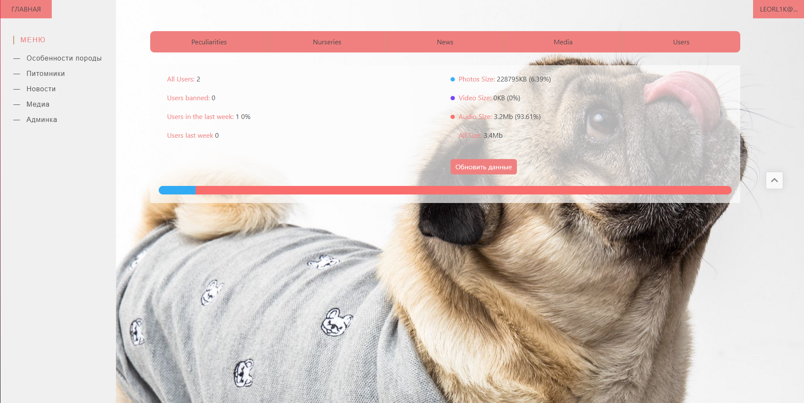
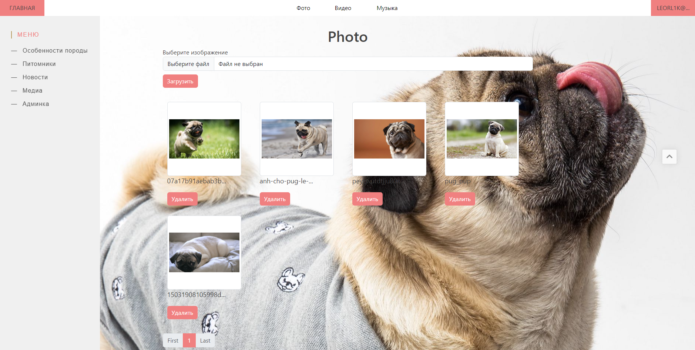

# php-web-pugs
## Описание:
Тестовый сайт с попыткой использовать минимальное кол-во инструментов: php, js, html, css. Структура проект вдохновлена MVC Laravel.

- DB: **mysql** 5.7, connect: **PDO** - singleton.
- Рукописный маршрутизатор и автозагрузчик классов.
- Верифкация через подтверждение почты(PHPMailer).
- Личный кабинет пользователя с возможностью связаться с администратором по почте.

## Админ панель:

- CRUD медиа файлов.
- Статистика медиа файлов(относительный объем, ограничение загрузки для администраторов).
- Статистика новых пользователей за неделю и относительно предыдущей недели.
- Управление пользователями(блокировка, смена роли и т.д). Возможность сортировки и поиска по разным полям.
- CRUD новостей(удаление комментариев), питомников, статей.

## Preview:

